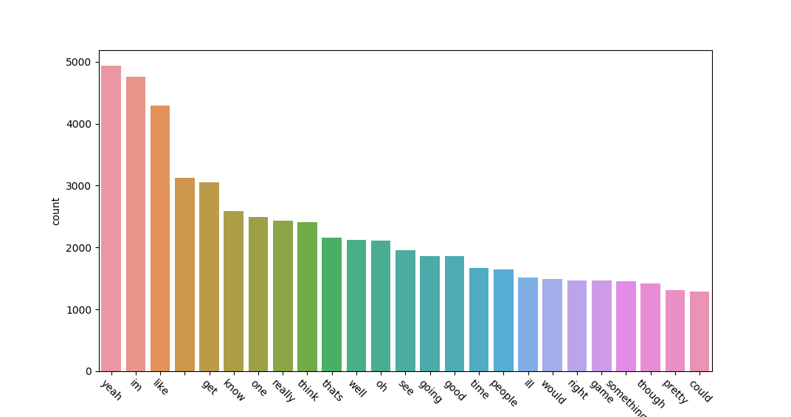
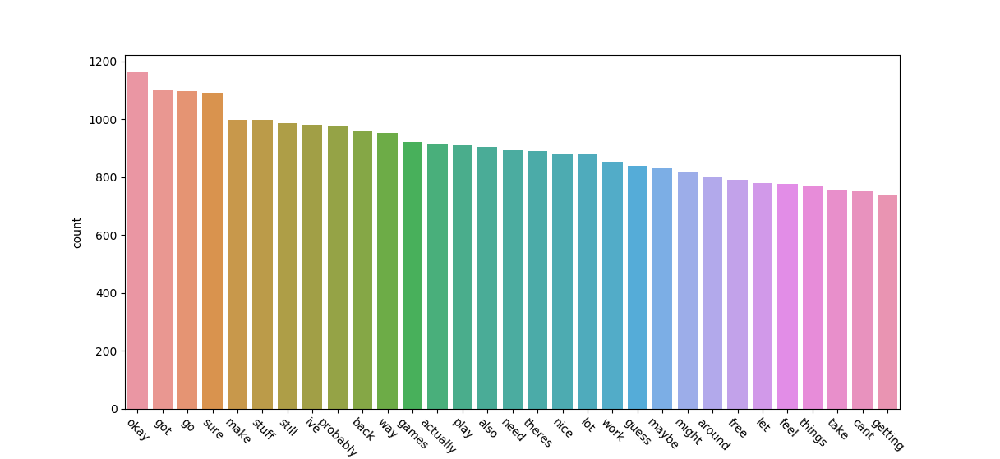
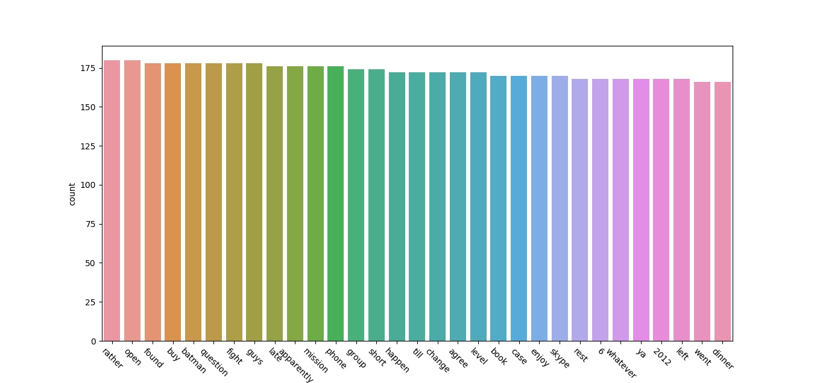
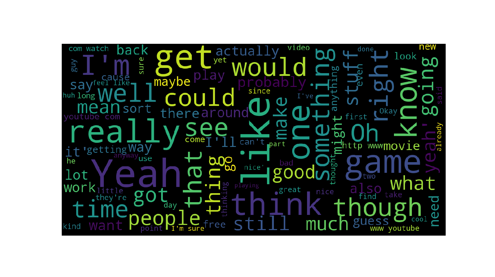
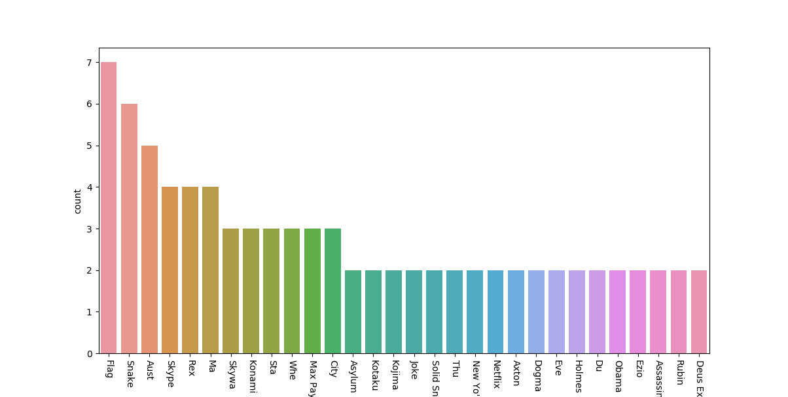
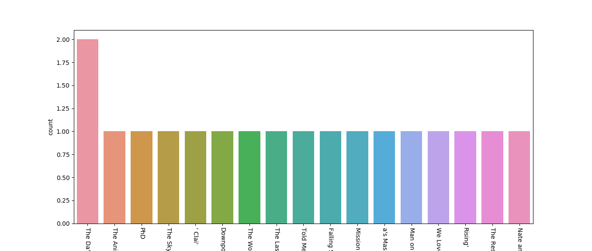
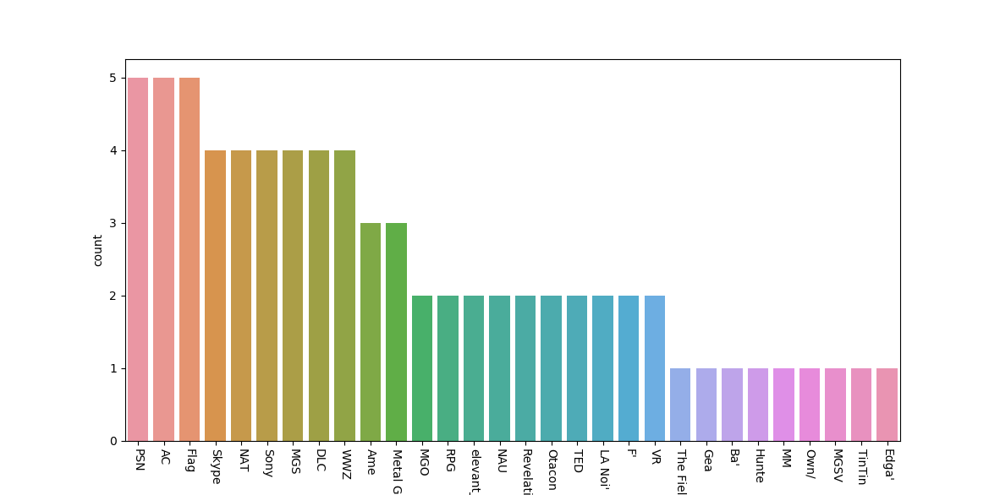
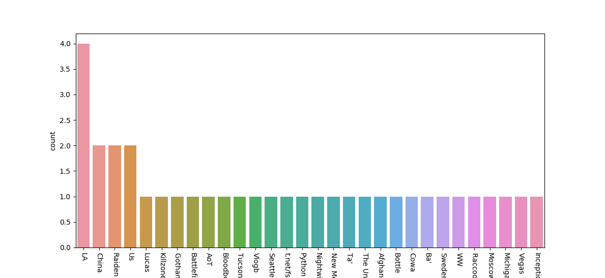

### Facebook Text Data Analysis

Facebook contains a ton of data about us. If we can get access to it and visualize it, we can potentially learn a lot of interesting things about ourselves. This project visualizes/analyzes Facebook text data in several different ways. It is intended to provide people with a number of functions they can use to visualize their own data.

The Facebook data download returns information in HTML files. For the purposes of this analysis, we are primarily interested in the user's comments, the user's posts, and user messages.

First, we'll create a function to extract data from the comments HTML file and save it as a CSV.

``` Python
from bs4 import BeautifulSoup
import csv

def extract_comments(comments_file):

    with open(comments_file, encoding="utf-8", errors='ignore') as infile:
        soup = BeautifulSoup(infile, "html.parser")

    comments = []

    for comment in soup.find_all('div', {"class": "_2pin"}):
        comments.append(comment.text)

    with open('fb_comments.csv', mode='a', encoding='utf-8', errors='ignore', newline='') as file:
        writer = csv.writer(file, delimiter=',')
        for comment in comments:
            writer.writerow([comment])

extract_comments("comments.html")
```

This exact same function format can also be used to extract posts from the "posts" HTML file. Getting messages is a little different, because the format is different and message threads contain messages from all participants. 

``` Python
def get_messages(messages_file):

    with open(messages_file, encoding="utf-8", errors='ignore') as infile:
        soup = BeautifulSoup(infile, "html.parser")
        messages = []
    
    for message in soup.find_all('div', {"class": "pam _3-95 _2pi0 _2lej uiBoxWhite noborder"}):
        messages.append(message)
    
    soup2 = BeautifulSoup(str(messages),'html.parser')
    for div in soup2.find_all('div', {"class": "_3-94 _2lem"}):
        div.decompose()

    cleaned = soup2
    
    filtered_messages = []
    
    # assuming you only want the messagse you've sent your name would go here
    for comment in cleaned:
        if 'First Last' in str(comment):
            chunk = comment.text.replace('First Last', '')
            filtered_messages.append(chunk)
    
    print(filtered_messages)
    
    with open('fb_messages.csv', mode='a', encoding="utf-8", errors='ignore') as file:
        writer = csv.writer(file, delimiter=',')
        for comment in filtered_messages:
            writer.writerow([comment])
            
    # to save as a text file instead
    with open("fb_messages_text.txt", "w", encoding="utf-8") as text_file:
        text_file.write(str(filtered_messages))

# Insert messages here            
get_messages("message.html")
```

Now we can combine the CSVs into one, so we can do all our analysis on it at once if we wish. Although that might prove to be quite a bit of data, so I think when doing the analysis we may stick to the individual files. We also probably want to filter for Stop Words using NTLK. We can return the filtered text as a text file.

``` Python
import pandas as pd
from nltk.corpus import stopwords

def file_concat(file_1, file_2, file_3):

    f1 = pd.read_csv(file_1)
    f2 = pd.read_csv(file_2)
    f3 = pd.read_csv(file_3)

    print(f1.head(5))

    complete = pd.concat([f1, f2, f3], sort=False)
    complete.to_csv("fb_complete.csv", index=False, encoding='utf-8-sig')

file_concat("fb_comments.csv","fb_messages.csv","fb_posts.csv")

stop_words = set(stopwords.words('english'))

def filter_words(input_file, output_file):

    data = open(input_file, errors="ignore", encoding="utf-8").read()

    words = data.split()

    for w in words:
        if not w in stop_words:
            file = open(output_file, mode='a', errors="ignore", encoding="utf-8")
            file.write("{} {}".format(w, ""))
            file.close()

filter_words("fb_complete.csv", "filtered_words.txt")
```

Now we can begin conducting analysis on the data. First, let's start by getting the most commonly used words and visualizing them.

``` Python
# open the file
text = open('filtered_words.txt', mode='r', encoding='utf-8-sig').read()

# split up the words into a list
words = text.split()

### Count Most Used Words ###

def word_count_viz(words_list):

    # create an empty dictionary to store the words
    word_count = {}

    # create a translator using the string function, this will remove any punctuation

    translator = str.maketrans('', '', string.punctuation)
    stop_words = set(stopwords.words('english'))

    for w in words_list:
        w = w.translate(translator).lower()
        if w not in stop_words:
            if w not in word_count:
                word_count[w] = 1
            else:
                word_count[w] += 1

    print(word_count)

    word_count_list = Counter(word_count)
    listy = word_count_list.most_common()

    df = pd.DataFrame(listy, columns=['word', 'count'])
    df2 = df.dropna(axis=0, how='any')

    df2.to_csv('word_counts', index=False)
    print(df2.head(250))
    # Here's where we can decide how many of the 
    # most commonly used words we want to visualize
    sns.barplot(x=df2['word'][0:25], y=df2['count'])
    plt.xticks(rotation=-45)
    plt.show()

word_count_viz(words)
```

Initially, when I plot the count of words, I get this: 



It looks like that even after filtering for common words/stop words the top 25 words still don't contain a lot of useful data. We aren't very likely to get much information on the kinds of topics I'm likely to talk about (although anecdotally, I can say I definitely say "yeah" a lot, so that's accurately reflected here). 

(Incidentally, This is why many natural language processing tasks use something called Term Frequency-Inverse Document Frequency, to suppress the capturing of commonly used words and get words which are likely to hint at document meaning.) 

Suppose I try ignoring the top 30 words or so and see what that returns. 



After ignoring the top 30 words we're getting a little closer to meaningful word representation. "Games", "play", and "work" are all topics I'm likely to talk about with friends.  Incidentally, here's what happened when I visualized words 300 to 330. Apparently I talk about "dinner" almost as much as I talk about "batman".



Is there a better way to see what kind of topics you talk about? Yes, but we'll get back to that. For now, let's do some sentiment analysis. Sentiment analysis captures the "sentiment" or "tone" of the text, like "positive" or "negative".  I'm curious to see if my posts are positive or negative in general.

Here's how we'd do Sentiment Analysis on the docs. We need to go through the list of sentences in the doc and do sentiment analysis on each of them individually. This first function calls sentiment analysis for every row in the CSV. It uses two sentiment analysis modules: TextBlob and Vader. It then creates a new dataframe, appends the votes of the sentiment classifiers and saves them into a CSV.

TextBlob and Vader both return polarity scores relating to the text, with the value of the score representing how positive/negative the sentence is. The closer to 1.00 the polarity is, the more positive. The closer to -1.00 the polarity is, the more negative the sentence is. It's possible to set a threshold for what we will accept as positive and negative classifications by labeling polarity scores that fall in a certain range. 

Let's assume we only want sentences that are rated highly positive or negative to count as examples of those classes. We can handle that by only examples rated 0.5 or above as positive and -0.5 or below as negative, while anything else is unknown.

``` Python
tb_sentiments = []
custom_sentiments = []
vader_sentiments = []

def sentiment_analysis(csv_documemnt):

    sentiment_text = open(csv_documemnt, mode='r', errors='ignore')
    text_read = csv.reader(sentiment_text)

    for row in text_read:

        print("Analyzing sentence...")
        text_blob_analysis = TextBlob(str(row))

        sentiment = text_blob_analysis.sentiment.polarity

        if sentiment >= 0.05:
            tb_sentiments.append('Pos')
        elif sentiment <= 0.049 and sentiment >= -0.049:
            tb_sentiments.append('Unk')
        elif sentiment <= -0.05:
            tb_sentiments.append('Neg')

        analyzer = SentimentIntensityAnalyzer()
        sentiment_2 = analyzer.polarity_scores(str(row))
        if sentiment_2['compound'] >= 0.05:
            vader_sentiments.append('Pos')
        elif sentiment_2['compound'] <= 0.049 and sentiment_3['compound'] >= -0.049:
            vader_sentiments.append('Unk')
        elif sentiment_2['compound'] <= -0.05:
            vader_sentiments.append('Neg')

sentiment_analysis("fb_posts.csv")
```

Now we can create a function to count which sentences have been rated as positive or negative by both classifiers. We're only counting those that both classifiers agree on, as it means more ambiguous sentences will be skipped.

``` Python
tb_sent_df = pd.DataFrame(tb_sentiments, columns=['TB Sentiment'])
vader_sent_df = pd.DataFrame(vader_sentiments, columns=['VD_Sentiment'])
new_df = pd.read_csv('fb_posts.csv', names=['Post'])
new_df.insert(1, "TB_Sent", tb_sent_df)
new_df.insert(2, "VD Sentiment", vader_sent_df)
print(new_df.head())
new_df.to_csv('fb_posts_sentiment5.csv')

def get_sent_counts(input_csv):
    num_pos = 0
    num_neg = 0

    dataframe = pd.read_csv(input_csv)

    for idx, row in dataframe.iterrows():
        if row['TB_Sent'] and row['VD Sentiment'] == 'Pos':
            num_pos += 1
        if row['TB_Sent'] and row['VD Sentiment'] == 'Neg':
            num_neg += 1

    print("Total positive posts: " + str(num_pos))
    print("Total negative posts: " + str(num_neg))
    
get_sent_counts('fb_posts_sentiment5.csv')
```

Here's the result of the analysis. 

``` Python
"Total positive posts: 789"
"Total negative posts: 323
```

Looks like in general I have more positive posts than negative posts.

Here's another method to visualize commonly used words. We can also create a word cloud/word bubble.  There's a handy library that makes creating word clouds easy, called simply WordCloud. We can even pass in stop words directly into the function, so it knows what words to filter out.

``` Python
### Create Word Clouds ###
# word cloud bubble

nltk_stop_words = set(stopwords.words('english'))

text2 = open('fb_messages_text.txt', mode='r', encoding='utf-8-sig')
lines = text2.readlines()[:]
text_complete = "".join(lines)
#print(text_complete)

def make_wordcloud(data, title = None):
    wordcloud = WordCloud(background_color='black',
        max_words=100,
        max_font_size=40,
        scale=3,
        random_state=3,
        stopwords=nltk_stop_words
    ).generate(str(data))

    fig = plt.figure(1, figsize=(15, 15))
    plt.axis('off')

    if title:
        fig.suptitle(title, fontsize=20)
        fig.subplots_adjust(top=2.3)

    plt.imshow(wordcloud)
    plt.show()

make_wordcloud(text_complete)
```

Here's the word cloud it generated from my messages:



Nothing super surprising here, I talk about games, movies, and YouTube with my friends a lot. Still a lot of very common words, but at least we're getting a glimpse into some interesting words/topics. Your mileage may vary on this one, and if you filter out common words of yours you may get some interesting results. Honestly, the best way to improve the results here would be to carry out a tf_idf filtering scheme and have the words scaled to their relative frequency. 

Speaking of topics, is there anyway we can analyze text for topics directly? It turns out there is. 

Here's one more thing we can do. We can carry out Named Entity Recognition. In order to do Named Entity Recognition, we'll be using a function called en_core_web_sm, which is part of the Spacy library. "en_core_web_sm" is an easy way to visualize name entities, although it can often misclassify words or phrases.  You can get some information on the supported name entity types [HERE](https://spacy.io/api/annotation#named-entities).

We can also drop any extremely commonly used phrases that our Stop Words haven't filtered out but we don't want appearing in the results of the entity recognition. We can then see what labels and items we can work with.

Finally, we'll get the actual list of entities and store them in dataframes according to their type. Let's take a look at what kind of entities the module is capable of tracking. If we get labels for the entities and then count the labels and return them, along with their count, we can see what kind of entities the module tracks and roughly how often they occur in our chosen document. 

``` Python
nlp = en_core_web_sm.load()

# make a list of common words/phrases to drop
drop_list = '|'.join(["Stitcher", "Goodreads", "Travel Ninja", 'Stitche'])
text_csv = pd.read_csv('fb_messages.csv', 'r', error_bad_lines=False, names=['Messages'])
text_csv = text_csv[~text_csv.Messages.str.contains(drop_list, na=False)]
#print(text_csv.head(5))

sentences = text_csv['Messages'].tolist()
print(sentences)

doc = nlp(str(sentences))
print([(X.text, X.label_) for X in doc.ents])

labels = [x.label_ for x in doc.ents]
print(Counter(labels))

items = [x.text for x in doc.ents]
print(Counter(items).most_common(20))
```

Here's the result of the print statement:

``` Python
Counter({'PERSON': 251, 'ORG': 178, 'CARDINAL': 173, 'DATE': 130, 'TIME': 98, 'GPE': 45, 'ORDINAL': 20, 'WORK_OF_ART': 18, 'NORP': 18, 'PRODUCT': 14, 'FAC': 14, 'PERCENT': 4, 'QUANTITY': 4, 'LOC': 3, 'LAW': 3, 'MONEY': 2, 'LANGUAGE': 1})
```

Among other things, we can easily track people, organizations, places (cardinal), data and times, and works of art. Here's the guide to what the module can track. Now that we've gotten a sense of what can be tracked, let's count the words and make a list of entities, then create separate dataframes holding the entities, their names and the value counts.

``` Python
def word_counter(doc, ent_name, col_name):
    ent_list = []
    for ent in doc.ents:
        if ent.label_ == ent_name:
            ent_list.append(ent.text)
    df = pd.DataFrame(data=ent_list, columns=[col_name])
    return df

persons_df = word_counter(doc, 'PERSON', 'Named Entities')
#print(persons_df.head(5))

art_df = word_counter(doc, 'WORK_OF_ART', 'Works Of Art')
#print(art_df.head(5))

org_df = word_counter(doc, 'ORG', 'Organizations')
#print(org_df.head(5))

gpe_df = word_counter(doc, 'GPE', 'GPEs')
#print(gpe_df.head(5))

norp_df = word_counter(doc, 'NORP', 'NORPs')
#print(norp_df.head(5))

prod_df = word_counter(doc, 'PRODUCT', 'Products')
#print(prod_df.head(5))
```

Now it is just a matter of plotting the data.

``` Python
def plot_categories(column, df, num):
    sns.countplot(x=column, data=df,
                  order=df[column].value_counts().iloc[0:num].index)
    plt.xticks(rotation=-45)
    plt.show()

plot_categories("Named Entities", persons_df, 30)
plot_categories("Works Of Art", art_df, 30)
plot_categories("Organizations", org_df, 30)
plot_categories("GPEs", gpe_df, 30)
plot_categories("NORPs", norp_df, 30)
plot_categories("Products", prod_df, 30)
```

Here's what comes up when plotting Named Entities. I talk about a lot of video game characters, haha. I also mention Obama in there though.



Here's the results of the Works of Art plot. At a glance, many of these are indeed works of art.



Here's the Organizations plot.



Here's GPEs plot. I find it funny it has classified "Python" as a place.




Well that's it, hopefully this proves somewhat useful or instructive in visualizing your own Facebook data. By tweaking these functions I'm sure you'll be able to get better results, but this should provide a good starting point.

Thanks to Susan Li for [instructions on visualizing named entities](https://towardsdatascience.com/named-entity-recognition-with-nltk-and-spacy-8c4a7d88e7da) with Spacy.
